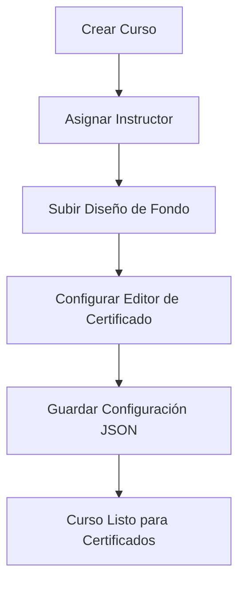
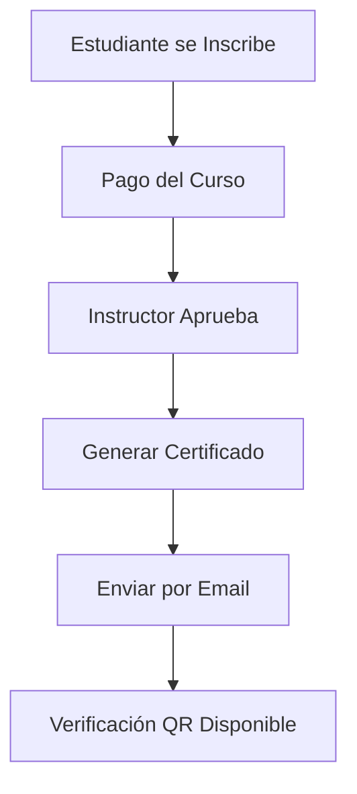
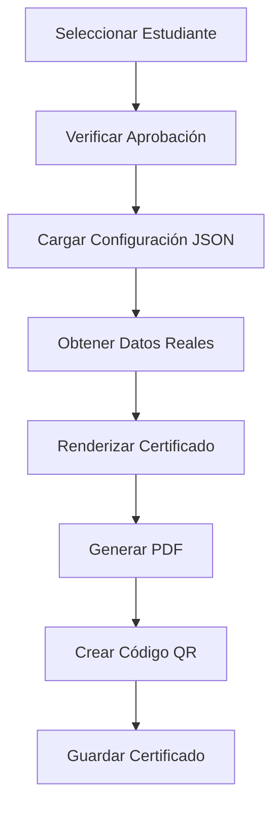
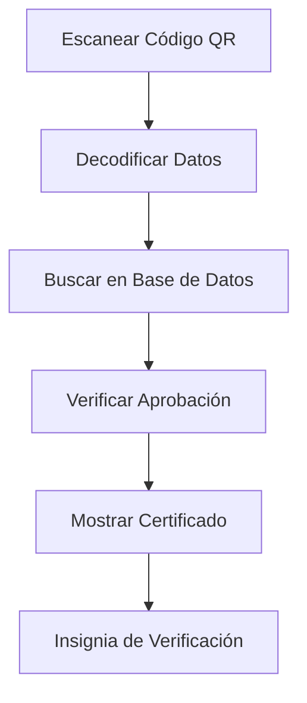

# DOCUMENTACIÓN TÉCNICA DEL SISTEMA DE CERTIFICADOS AUTOMÁTICOS

## ÍNDICE

1. [RESUMEN EJECUTIVO](#resumen-ejecutivo)
2. [ARQUITECTURA DEL SISTEMA](#arquitectura-del-sistema)
3. [COMPONENTES PRINCIPALES](#componentes-principales)
4. [BASE DE DATOS](#base-de-datos)
5. [MÓDULOS DEL SISTEMA](#módulos-del-sistema)
6. [FLUJOS DE TRABAJO](#flujos-de-trabajo)
7. [INTERFACES DE USUARIO](#interfaces-de-usuario)
8. [SISTEMA DE VERIFICACIÓN QR](#sistema-de-verificación-qr)
9. [CONFIGURACIÓN Y DESPLIEGUE](#configuración-y-despliegue)
10. [MANTENIMIENTO Y SOPORTE](#mantenimiento-y-soporte)
11. [SEGURIDAD](#seguridad)
12. [APÉNDICES](#apéndices)

---

## RESUMEN EJECUTIVO

El Sistema de Certificados Automáticos es una plataforma web completa desarrollada en PHP que permite la gestión integral de cursos, estudiantes, certificaciones y verificación de autenticidad mediante códigos QR.

### Características Principales
- Editor Visual de Certificados tipo Canva
- Generación Automática de PDFs
- Sistema de Verificación QR público
- Gestión completa de cursos y estudiantes
- Panel administrativo con dashboard
- Interfaz responsive

### Tecnologías
- Backend: PHP 7.4+, PDO, MySQL
- Frontend: HTML5, CSS3, JavaScript, Bootstrap 5
- Librerías: FPDF, HTML5-QRCode
- Base de Datos: MySQL 8.0+

---

## ARQUITECTURA DEL SISTEMA

### Estructura de Directorios
```
certificado/
├── admin/                    # Panel administrativo
│   ├── inc/                 # Configuraciones
│   ├── assets/              # Recursos estáticos
│   └── [módulos admin]
├── assets/                  # Recursos frontend
├── payment/                 # Módulo de pagos
└── [archivos frontend]
```

### Patrón de Arquitectura

- **MVC Simplificado**: Separación de lógica, presentación y datos
- **Capa de Acceso a Datos**: Uso de PDO para consultas seguras
- **Sesiones**: Gestión de autenticación y autorización
- **Modular**: Componentes independientes y reutilizables

---

## COMPONENTES PRINCIPALES

### 1. Panel Administrativo
- Gestión de Cursos
- Gestión de Estudiantes
- Gestión de Instructores/Especialistas
- Editor de Certificados
- Dashboard de Certificados

### 2. Editor de Certificados
**Archivo**: `admin/editor_certificado.php`

**Funcionalidades**:
- Interfaz drag-and-drop
- Elementos dinámicos (texto, imágenes, firmas, QR)
- Estilos avanzados
- Previsualización en tiempo real
- Configuración JSON

**Tipos de Elementos**:
- `nombre_alumno`: Nombre del estudiante
- `fecha`: Fecha de emisión
- `instructor`: Nombre del instructor
- `especialista`: Nombre del especialista
- `firma_instructor`: Firma digital
- `firma_especialista`: Firma digital
- `qr`: Código QR

### 3. Gestión de Certificados
**Archivo**: `admin/gestionar_certificados.php`

**Dashboard**:
- Estadísticas por curso
- Progreso de certificación
- Acciones rápidas
- Previsualización

### 4. Sistema de Verificación QR

**Componentes**:
- `verificar-qr.php`: Escáner QR
- `verificar-certificado.php`: Verificación
- `admin/generar_qr.php`: Generador QR

**Flujo**:
1. Escanear código QR
2. Decodificar datos
3. Validar en base de datos
4. Mostrar certificado verificado

**Formato QR**: `idcurso-idalumno-fecha`

---

## BASE DE DATOS

### Esquema Principal

#### Tabla `curso`

```sql
CREATE TABLE `curso` (
  `idcurso` int(11) NOT NULL AUTO_INCREMENT,
  `nombre_curso` varchar(100) NOT NULL,
  `descripcion` text NOT NULL,
  `duracion` int(11) NOT NULL,
  `idcategoria` int(11) NOT NULL,
  `idinstructor` int(11) NOT NULL,
  `estado` varchar(20) NOT NULL,
  `dias_semana` varchar(100) NOT NULL,
  `hora_inicio` time NOT NULL,
  `hora_fin` time NOT NULL,
  `precio` decimal(10,2) DEFAULT 0.00,
  `cupos_disponibles` int(11) DEFAULT 0,
  `fecha_inicio` date DEFAULT NULL,
  `fecha_fin` date DEFAULT NULL,
  `requisitos` text DEFAULT NULL,
  `objetivos` text DEFAULT NULL,
  `diseño` text,
  `config_certificado` longtext,
  PRIMARY KEY (`idcurso`)
);
```

#### Tabla `cliente`

```sql
CREATE TABLE `cliente` (
  `idcliente` int(11) NOT NULL AUTO_INCREMENT,
  `nombre` varchar(100) NOT NULL,
  `apellido` varchar(100) NOT NULL,
  `dni` varchar(20) NOT NULL,
  `telefono` varchar(20) NOT NULL,
  `email` varchar(100) NOT NULL,
  `direccion` text NOT NULL,
  `fecha_registro` datetime DEFAULT current_timestamp(),
  `estado` enum('Activo','Inactivo') DEFAULT 'Activo',
  `observaciones` text DEFAULT NULL,
  PRIMARY KEY (`idcliente`)
);
```

#### Tabla `inscripcion`

```sql
CREATE TABLE `inscripcion` (
  `idinscripcion` int(11) NOT NULL AUTO_INCREMENT,
  `idcliente` int(11) NOT NULL,
  `idcurso` int(11) NOT NULL,
  `fecha_inscripcion` date NOT NULL,
  `estado` enum('Pendiente','Aprobado','Rechazado','Cancelado') DEFAULT 'Pendiente',
  `nota_final` decimal(10,2) DEFAULT NULL,
  `fecha_aprobacion` datetime DEFAULT NULL,
  `observaciones` text DEFAULT NULL,
  `monto_pago` decimal(10,2) DEFAULT 0.00,
  `estado_pago` enum('Pendiente','Pagado','Reembolsado') DEFAULT 'Pendiente',
  `metodo_pago` varchar(50) DEFAULT NULL,
  `comprobante_pago` varchar(255) DEFAULT NULL,
  PRIMARY KEY (`idinscripcion`)
);
```

#### Tabla `instructor`

```sql
CREATE TABLE `instructor` (
  `idinstructor` int(11) NOT NULL AUTO_INCREMENT,
  `nombre` varchar(100) NOT NULL,
  `apellido` varchar(100) NOT NULL,
  `especialidad` varchar(100) NOT NULL,
  `experiencia` int(11) NOT NULL,
  `email` varchar(100) NOT NULL,
  `telefono` varchar(20) NOT NULL,
  `firma_digital` text,
  PRIMARY KEY (`idinstructor`)
);
```

#### Tabla `especialista`

```sql
CREATE TABLE `especialista` (
  `idespecialista` int(11) NOT NULL AUTO_INCREMENT,
  `nombre` varchar(100) NOT NULL,
  `apellido` varchar(100) NOT NULL,
  `especialidad` varchar(100) NOT NULL,
  `experiencia` int(11) NOT NULL,
  `email` varchar(100) NOT NULL,
  `telefono` varchar(20) NOT NULL,
  `firma_especialista` text,
  PRIMARY KEY (`idespecialista`)
);
```

### Relaciones Principales

- `curso` ↔ `categoria` (idcategoria)
- `curso` ↔ `instructor` (idinstructor)
- `inscripcion` ↔ `cliente` (idcliente)
- `inscripcion` ↔ `curso` (idcurso)

---

## MÓDULOS DEL SISTEMA

### 1. Editor de Certificados (`admin/editor_certificado.php`)

#### Funcionalidades

- **Interfaz Visual**: Editor drag-and-drop tipo Canva
- **Elementos Dinámicos**: Campos de texto, imágenes, firmas, QR
- **Estilos Avanzados**: Fuentes, colores, tamaños, efectos
- **Previsualización**: Vista previa en tiempo real
- **Configuración JSON**: Almacenamiento de diseño en base de datos

#### Tipos de Elementos Soportados

```javascript
// Campos de Texto
- nombre_alumno: Nombre completo del estudiante
- fecha: Fecha de emisión del certificado
- instructor: Nombre del instructor
- especialista: Nombre del especialista
- texto: Texto personalizado

// Elementos de Imagen
- firma_digital: Firma digital del instructor
- firma_especialista: Firma digital del especialista
- qr: Código QR del certificado
```

#### Estructura de Configuración JSON

```json
{
  "campos": [
    {
      "id": "campo_1",
      "tipo": "nombre_alumno",
      "left": 100,
      "top": 150,
      "width": 200,
      "height": 30,
      "fontSize": 18,
      "fontFamily": "Arial",
      "color": "#000000",
      "textAlign": "center",
      "fontWeight": "bold",
      "fontStyle": "normal",
      "textDecoration": "none",
      "lineHeight": 1.2,
      "letterSpacing": 0,
      "rotation": 0,
      "opacity": 1,
      "shadowColor": "#000000",
      "shadowBlur": 0,
      "shadowOffsetX": 0,
      "shadowOffsetY": 0
    }
  ]
}
```

### 2. Gestión de Certificados (`admin/gestionar_certificados.php`)

#### Dashboard Principal

- **Estadísticas por Curso**: Inscritos, aprobados, pendientes
- **Progreso de Certificación**: Barras de progreso visuales
- **Acciones Rápidas**: Generar certificados individuales o masivos
- **Previsualización**: Vista miniatura del certificado real

#### Funcionalidades

- **Generación Individual**: Crear certificado para un estudiante específico
- **Generación Masiva**: Procesar todos los certificados pendientes
- **Previsualización**: Ver certificado con datos reales
- **Descarga**: Generar PDF del certificado

### 3. Generación de Certificados (`admin/generar_certificado_final.php`)

#### Proceso de Generación

1. **Obtención de Datos**: Curso, estudiante, instructor, especialista
2. **Aplicación de Configuración**: Cargar diseño JSON
3. **Renderizado**: Crear certificado con FPDF
4. **Firmas**: Integrar firmas digitales
5. **QR**: Generar código QR único
6. **PDF**: Exportar documento final

#### Características del PDF

- **Alta Calidad**: Vectorial y escalable
- **Firmas Digitales**: Integradas en el documento
- **Código QR**: Único por certificado
- **Datos Verificables**: Información completa del estudiante

### 4. Sistema de Verificación QR

#### Componentes

- **Escáner QR** (`verificar-qr.php`): Interfaz para escanear códigos
- **Verificación** (`verificar-certificado.php`): Página de verificación
- **Generador QR** (`admin/generar_qr.php`): Creación de códigos QR

#### Flujo de Verificación

1. **Escaneo**: Usuario escanea código QR
2. **Decodificación**: Extraer datos del código
3. **Validación**: Verificar en base de datos
4. **Renderizado**: Mostrar certificado verificado
5. **Información**: Mostrar datos del estudiante y curso

#### Formato del Código QR

```
Formato: idcurso-idalumno-fecha
Ejemplo: 1-25-2024-01-15
```

---

## FLUJOS DE TRABAJO

### 1. Configuración de un Curso



### 2. Proceso de Inscripción



### 3. Generación de Certificados



### 4. Verificación de Certificados



---

## INTERFACES DE USUARIO

### 1. Panel Administrativo

#### Header (`admin/header.php`)

- **Navegación**: Menú lateral con módulos
- **Usuario**: Información del administrador logueado
- **Notificaciones**: Alertas y mensajes del sistema

#### Dashboard (`admin/index.php`)

- **Estadísticas**: Resumen de cursos, estudiantes, certificados
- **Gráficos**: Visualización de datos
- **Acciones Rápidas**: Enlaces a funciones principales

#### Editor de Certificados

- **Área de Trabajo**: Canvas para diseño
- **Panel de Controles**: Herramientas de edición
- **Previsualización**: Vista previa en tiempo real
- **Guardado**: Persistencia de configuración

### 2. Frontend Público

#### Header (`header.php`)

- **Logo**: Identidad de la institución
- **Navegación**: Menú principal
- **Búsqueda**: Buscador de cursos
- **Usuario**: Área de usuario logueado

#### Página de Inicio (`index.php`)

- **Slider**: Imágenes promocionales
- **Cursos Destacados**: Catálogo principal
- **Servicios**: Información de la institución
- **Verificación QR**: Sección promocional

#### Verificación de Certificados

- **Escáner QR**: Interfaz de cámara
- **Ingreso Manual**: Campo para códigos QR
- **Resultado**: Certificado verificado
- **Información**: Datos del estudiante

---

## SISTEMA DE VERIFICACIÓN QR

### Arquitectura del Sistema QR

#### 1. Generación de Códigos QR

**Archivo**: `admin/generar_qr.php`

```php
// Genera código QR con datos del certificado
$qr_data = $idcurso . '-' . $idalumno . '-' . $fecha;
$qr_url = BASE_URL . 'verificar-certificado.php?qr=' . $qr_data;
```

#### 2. Escáner QR

**Archivo**: `verificar-qr.php`

- **HTML5-QRCode**: Librería para escaneo
- **Cámara en Tiempo Real**: Acceso a cámara del dispositivo
- **Decodificación Automática**: Procesamiento instantáneo

#### 3. Verificación

**Archivo**: `verificar-certificado.php`

- **Validación de Datos**: Verificación en base de datos
- **Renderizado**: Mostrar certificado con datos reales
- **Insignia de Verificación**: Indicador de autenticidad

### Características de Seguridad

#### 1. Validación Completa

- Verificación de existencia del curso
- Confirmación de inscripción del estudiante
- Validación de estado de aprobación
- Verificación de configuración del certificado

#### 2. Protección contra Falsificación

- Códigos QR únicos por certificado
- Datos verificados desde base de datos
- Insignia de verificación visible
- Información completa del estudiante

#### 3. Acceso Público

- No requiere autenticación
- Compatible con cualquier escáner QR
- Responsive para dispositivos móviles
- Interfaz intuitiva

---

## CONFIGURACIÓN Y DESPLIEGUE

### Requisitos del Sistema

#### Servidor Web

- **Apache 2.4+** o **Nginx 1.18+**
- **PHP 7.4+** con extensiones:
  - PDO MySQL
  - GD (para imágenes)
  - JSON
  - cURL
  - OpenSSL

#### Base de Datos

- **MySQL 8.0+** o **MariaDB 10.3+**
- **Caracteres**: UTF-8
- **Collation**: utf8mb4_unicode_ci

#### Espacio en Disco

- **Mínimo**: 500MB
- **Recomendado**: 2GB+
- **Crecimiento**: ~100MB por 1000 certificados

### Instalación

#### 1. Preparación del Servidor

```bash
# Instalar dependencias
sudo apt update
sudo apt install apache2 php mysql-server php-mysql php-gd php-curl

# Habilitar mod_rewrite
sudo a2enmod rewrite
sudo systemctl restart apache2
```

#### 2. Configuración de Base de Datos

```sql
-- Crear base de datos
CREATE DATABASE certificados CHARACTER SET utf8mb4 COLLATE utf8mb4_unicode_ci;

-- Importar estructura
mysql -u root -p certificados < certificados.sql

-- Crear usuario específico
CREATE USER 'cert_user'@'localhost' IDENTIFIED BY 'password';
GRANT ALL PRIVILEGES ON certificados.* TO 'cert_user'@'localhost';
FLUSH PRIVILEGES;
```

#### 3. Configuración de PHP

```ini
; php.ini
upload_max_filesize = 10M
post_max_size = 10M
max_execution_time = 300
memory_limit = 256M
```

#### 4. Configuración del Proyecto

```php
// admin/inc/config.php
$host = 'localhost';
$dbname = 'certificados';
$username = 'cert_user';
$password = 'password';

// Definir URLs base
define("BASE_URL", "https://tudominio.com/certificado/");
define("ADMIN_URL", BASE_URL . "admin/");
```

### Estructura de Permisos

```bash
# Directorios de subida
chmod 755 assets/uploads/
chmod 755 assets/uploads/cursos/
chmod 755 assets/uploads/firmas/
chmod 755 assets/uploads/comprobantes/

# Archivos de configuración
chmod 644 admin/inc/config.php
chmod 644 phpmailer-config.php
```

---

## MANTENIMIENTO Y SOPORTE

### Tareas de Mantenimiento

#### 1. Respaldos de Base de Datos

```bash
#!/bin/bash
# backup.sh
DATE=$(date +%Y%m%d_%H%M%S)
mysqldump -u cert_user -p certificados > backup_$DATE.sql
gzip backup_$DATE.sql
```

#### 2. Limpieza de Archivos Temporales

```php
// Limpiar archivos temporales cada 30 días
$temp_files = glob('temp/*');
foreach($temp_files as $file) {
    if (time() - filemtime($file) > 30 * 24 * 60 * 60) {
        unlink($file);
    }
}
```

#### 3. Optimización de Base de Datos

```sql
-- Optimizar tablas mensualmente
OPTIMIZE TABLE curso, cliente, inscripcion, instructor, especialista;

-- Analizar estadísticas
ANALYZE TABLE curso, cliente, inscripcion;
```

### Monitoreo del Sistema

#### 1. Logs de Acceso

```apache
# .htaccess
LogLevel warn
CustomLog /var/log/apache2/certificados_access.log combined
ErrorLog /var/log/apache2/certificados_error.log
```

#### 2. Monitoreo de Errores PHP

```php
// Log de errores personalizado
ini_set('log_errors', 1);
ini_set('error_log', '/var/log/php/certificados_errors.log');
```

#### 3. Métricas de Rendimiento

- **Tiempo de Respuesta**: < 2 segundos
- **Uptime**: > 99.5%
- **Espacio en Disco**: < 80% de uso
- **Memoria PHP**: < 256MB por request

### Actualizaciones

#### 1. Proceso de Actualización

```bash
# 1. Respaldar sistema actual
tar -czf backup_$(date +%Y%m%d).tar.gz /var/www/certificado/

# 2. Descargar nueva versión
wget https://github.com/usuario/certificados/archive/main.zip

# 3. Extraer y reemplazar
unzip main.zip
cp -r certificados-main/* /var/www/certificado/

# 4. Actualizar base de datos
mysql -u cert_user -p certificados < updates.sql

# 5. Verificar funcionamiento
curl -I https://tudominio.com/certificado/
```

#### 2. Control de Versiones

- **Git**: Repositorio centralizado
- **Tags**: Versiones estables marcadas
- **Branches**: Desarrollo separado de producción
- **Rollback**: Capacidad de revertir cambios

---

## SEGURIDAD

### Medidas de Seguridad Implementadas

#### 1. Autenticación y Autorización

```php
// Verificación de sesión
session_start();
if (!isset($_SESSION['user'])) {
    header('Location: login.php');
    exit;
}

// Verificación de roles
if ($_SESSION['user']['rol'] !== 'admin') {
    header('Location: index.php');
    exit;
}
```

#### 2. Protección CSRF

```php
// Token CSRF en formularios
class CSRF_Protect {
    public function generateToken() {
        if (!isset($_SESSION['csrf_token'])) {
            $_SESSION['csrf_token'] = bin2hex(random_bytes(32));
        }
        return $_SESSION['csrf_token'];
    }

    public function verifyToken($token) {
        return isset($_SESSION['csrf_token']) &&
               hash_equals($_SESSION['csrf_token'], $token);
    }
}
```

#### 3. Validación de Entrada

```php
// Sanitización de datos
$idcurso = filter_input(INPUT_GET, 'id', FILTER_VALIDATE_INT);
if ($idcurso === false || $idcurso <= 0) {
    header('Location: curso.php');
    exit;
}

// Prepared Statements
$stmt = $pdo->prepare("SELECT * FROM curso WHERE idcurso = ?");
$stmt->execute([$idcurso]);
```

#### 4. Protección de Archivos

```apache
# .htaccess - Proteger archivos sensibles
<Files "config.php">
    Order allow,deny
    Deny from all
</Files>

<Files "*.sql">
    Order allow,deny
    Deny from all
</Files>
```

#### 5. Validación de Subida de Archivos

```php
// Validación de tipos de archivo
$allowed_types = ['image/jpeg', 'image/png', 'image/gif'];
$max_size = 5 * 1024 * 1024; // 5MB

if (!in_array($_FILES['file']['type'], $allowed_types)) {
    throw new Exception('Tipo de archivo no permitido');
}

if ($_FILES['file']['size'] > $max_size) {
    throw new Exception('Archivo demasiado grande');
}
```

### Vulnerabilidades y Mitigaciones

#### 1. SQL Injection

- **Mitigación**: Uso exclusivo de Prepared Statements
- **Validación**: Filtrado de entrada de datos
- **Escape**: Escape de caracteres especiales

#### 2. XSS (Cross-Site Scripting)

- **Mitigación**: htmlspecialchars() en salida
- **Validación**: Filtrado de contenido HTML
- **Headers**: Content Security Policy

#### 3. File Upload Vulnerabilities

- **Mitigación**: Validación estricta de tipos
- **Renombrado**: Nombres únicos para archivos
- **Directorio**: Almacenamiento fuera del webroot

#### 4. Session Hijacking

- **Mitigación**: Regeneración de ID de sesión
- **HTTPS**: Uso obligatorio en producción
- **Timeout**: Expiración automática de sesiones

---

## APÉNDICES

### A. Códigos de Error Comunes

| Código | Descripción            | Solución                   |
| ------ | ---------------------- | -------------------------- |
| 1001   | Error de conexión a BD | Verificar config.php       |
| 1002   | Sesión expirada        | Re-login requerido         |
| 1003   | Permisos insuficientes | Verificar rol de usuario   |
| 1004   | Archivo no encontrado  | Verificar ruta de archivo  |
| 1005   | Error de validación    | Verificar datos de entrada |

### B. Comandos Útiles

#### Verificar Estado del Sistema

```bash
# Verificar servicios
systemctl status apache2 mysql php8.1-fpm

# Verificar logs
tail -f /var/log/apache2/error.log
tail -f /var/log/mysql/error.log

# Verificar espacio en disco
df -h
du -sh /var/www/certificado/
```

#### Optimización de Rendimiento

```bash
# Optimizar imágenes
find assets/uploads/ -name "*.jpg" -exec jpegoptim {} \;
find assets/uploads/ -name "*.png" -exec optipng {} \;

# Limpiar cache
rm -rf /tmp/php_sessions/*
rm -rf /var/cache/apache2/*
```

### C. Estructura de Archivos de Configuración

#### Configuración Principal (`admin/inc/config.php`)

```php
<?php
// Configuración de base de datos
$host = 'localhost';
$dbname = 'certificados';
$username = 'cert_user';
$password = 'password';

// Configuración de zona horaria
date_default_timezone_set('America/Lima');

// Configuración de URLs
define("BASE_URL", "https://tudominio.com/certificado/");
define("ADMIN_URL", BASE_URL . "admin/");

// Configuración de directorios
define('UPLOAD_PATH', $_SERVER['DOCUMENT_ROOT'] . '/certificado/assets/uploads/');
define('FIRMAS_PATH', UPLOAD_PATH . 'firmas/');
define('CURSOS_PATH', UPLOAD_PATH . 'cursos/');
```

#### Configuración de Email (`phpmailer-config.php`)

```php
<?php
// Configuración SMTP
define('SMTP_HOST', 'smtp.gmail.com');
define('SMTP_PORT', 587);
define('SMTP_USERNAME', 'tu-email@gmail.com');
define('SMTP_PASSWORD', 'tu-password-app');
define('SMTP_SECURE', 'tls');

// Configuración de remitente
define('FROM_EMAIL', 'noreply@tudominio.com');
define('FROM_NAME', 'Sistema de Certificados');
```

### D. API de Verificación (Futuro)

#### Endpoint de Verificación

```php
// api/verificar.php
header('Content-Type: application/json');

$qr_code = $_GET['qr'] ?? '';
$response = ['success' => false, 'message' => '', 'data' => null];

try {
    // Validar código QR
    $datos = validarCodigoQR($qr_code);

    // Obtener certificado
    $certificado = obtenerCertificado($datos);

    $response = [
        'success' => true,
        'message' => 'Certificado verificado',
        'data' => $certificado
    ];
} catch (Exception $e) {
    $response['message'] = $e->getMessage();
}

echo json_encode($response);
```

### E. Métricas y Analytics

#### Dashboard de Métricas

```php
// admin/metricas.php
$metricas = [
    'total_cursos' => $pdo->query("SELECT COUNT(*) FROM curso")->fetchColumn(),
    'total_estudiantes' => $pdo->query("SELECT COUNT(*) FROM cliente")->fetchColumn(),
    'certificados_generados' => $pdo->query("SELECT COUNT(*) FROM certificados_generados")->fetchColumn(),
    'verificaciones_hoy' => $pdo->query("SELECT COUNT(*) FROM log_verificaciones WHERE DATE(fecha) = CURDATE()")->fetchColumn(),
    'ingresos_mes' => $pdo->query("SELECT SUM(monto) FROM pago WHERE MONTH(fecha_pago) = MONTH(CURDATE())")->fetchColumn()
];
```

---

## CONCLUSIÓN

El Sistema de Certificados Automáticos representa una solución completa y robusta para la gestión de certificaciones educativas. Con su arquitectura modular, interfaz intuitiva y sistema de verificación QR, proporciona una plataforma profesional que satisface las necesidades tanto de instituciones educativas como de estudiantes y empleadores.

### Puntos Clave del Sistema

1. **Escalabilidad**: Arquitectura que permite crecimiento futuro
2. **Seguridad**: Múltiples capas de protección
3. **Usabilidad**: Interfaces intuitivas para todos los usuarios
4. **Verificabilidad**: Sistema QR público y confiable
5. **Mantenibilidad**: Código bien estructurado y documentado

### Recomendaciones para Producción

1. **Implementar HTTPS** en todos los entornos
2. **Configurar respaldos automáticos** de base de datos
3. **Monitorear logs** regularmente
4. **Actualizar dependencias** periódicamente
5. **Realizar pruebas de carga** antes del despliegue

El sistema está diseñado para ser una solución a largo plazo, con capacidad de evolución y adaptación a nuevas necesidades del mercado educativo.

---

**Documentación Versión**: 1.0  
**Fecha de Última Actualización**: Enero 2024  
**Autor**: Sistema de Certificados Automáticos  
**Contacto**: soporte@tudominio.com
